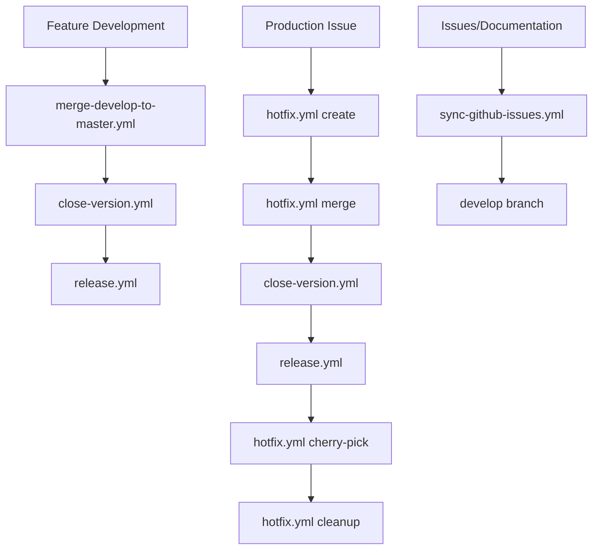

# GitHub Actions Workflows

This directory contains GitHub Actions workflows that automate various tasks for the Slack-Bitbucket Merge Control Chrome Extension project, following Git Flow guidelines.

## 🔄 Git Flow Workflows

These workflows implement and enforce the Git Flow branching strategy as defined in `documentation/GIT_FLOW.md`.

### 1. `merge-develop-to-master.yml` 🚀

**Purpose**: Controlled merge from develop to master for releases

**Trigger**: Manual dispatch with version input

**Git Flow Compliance**:

- Validates execution from develop branch
- Runs comprehensive test suite
- Creates Pull Request to master (recommended)
- Supports direct merge (use with caution)

**Usage**:

```bash
# Via GitHub UI: Actions → Merge Develop to Master
# Input: version (e.g., v1.0.0)
# Option: Create PR (recommended) or direct merge
```

### 2. `close-version.yml` 🏷️

**Purpose**: Tag and close version after merge to master

**Triggers**:

- Manual dispatch with version input
- Auto-trigger after PR merge from develop/release to master

**Git Flow Compliance**:

- Only executes on master branch
- Validates merge source (develop or release branches only)
- Creates version tags on master
- Updates package.json and manifest.json

**Usage**:

```bash
# Automatically runs after develop→master merge
# Or manually: Actions → Close Version
# Input: version (e.g., v1.0.0)
```

### 3. `hotfix.yml` 🚨

**Purpose**: Complete hotfix lifecycle management

**Actions**:

- `create`: Create hotfix branch from master
- `merge`: Create PR to merge hotfix to master
- `cherry-pick`: Apply hotfix changes to develop
- `cleanup`: Delete hotfix branch after completion

**Git Flow Compliance**:

- Hotfix branches created only from master
- Emergency testing before merge
- Automatic cherry-pick to develop
- Proper branch cleanup

**Usage**:

```bash
# 1. Create hotfix
Actions → Hotfix Workflow → create
Input: hotfix_name (e.g., critical-security-fix)

# 2. After implementing fix
Actions → Hotfix Workflow → merge
Input: hotfix_name, version (e.g., v1.0.1)

# 3. After merge and deployment
Actions → Hotfix Workflow → cherry-pick
Input: hotfix_name

# 4. Final cleanup
Actions → Hotfix Workflow → cleanup
Input: hotfix_name
```

### 4. `release.yml` 📦

**Purpose**: Create GitHub release from tagged version

**Trigger**: Manual dispatch (master branch only)

**Git Flow Compliance**:

- **🔒 Branch Restriction**: Only executes from master branch
- **Double Validation**: Workflow trigger + job-level branch check
- Validates tag exists on master
- Comprehensive release validation

**Usage**:

```bash
# IMPORTANT: Must be on master branch
git checkout master
git pull origin master

# Then: Actions → Build and Release Extension
# Note: Workflow will fail if not executed from master branch
```

**⚠️ Important**: This workflow is restricted to master branch only to ensure releases are created from stable, tagged code following Git Flow guidelines.

## 📋 Documentation Workflows

### 5. `sync-github-issues.yml` 📝

**Purpose**: Sync GitHub issues to documentation

**Triggers**:

- Issue events (opened, closed, labeled)
- Daily schedule (midnight UTC)
- Manual dispatch

**Git Flow Compliance**:

- Commits changes to develop branch
- Follows proper branching strategy

### 6. `setup-branch-protection.yml` 🔒

**Purpose**: Configure branch protection rules

**⚠️ Requirements**: 
- **Repository admin permissions** required
- User must have admin access to the repository
- Organization policies must allow branch protection configuration

**Actions**:
- `setup-all`: Configure both master and develop
- `setup-master`: Configure master branch only
- `setup-develop`: Configure develop branch only
- `remove-all`: Remove all protections
- `status`: Check current protection status

**Usage**:
```bash
# Ensure you have repository admin permissions first
# Then: Actions → Setup Branch Protection Rules
# Select desired action (setup-all recommended)
```

**Protection Rules**:

**Master Branch**:
- Required status checks (strict)
- Required approving reviews: 1
- Dismiss stale reviews: Yes
- Enforce for admins: Yes
- Allow force pushes: No
- Allow deletions: No
- Require conversation resolution: Yes

**Develop Branch**:
- Required status checks (strict)
- Required approving reviews: 1
- Allow force pushes: Yes (for maintainers)
- Less restrictive than master

**Troubleshooting**:
- **403 Permission Denied**: Ensure you have repository admin access
- **404 Branch Not Found**: Ensure target branches exist
- **Organization Policies**: Check if organization allows branch protection

## 🔄 Workflow Dependencies



## 📋 Git Flow Process

### Standard Release Process

1. **Development**: Work on feature branches from develop
2. **Integration**: Merge features to develop via PR
3. **Release Preparation**: Run `merge-develop-to-master.yml`
4. **Version Closing**: `close-version.yml` runs automatically
5. **Release**: Run `release.yml` to publish

### Hotfix Process

1. **Create**: `hotfix.yml` with `create` action
2. **Develop**: Implement fix on hotfix branch
3. **Merge**: `hotfix.yml` with `merge` action
4. **Deploy**: Deploy hotfix to production
5. **Sync**: `hotfix.yml` with `cherry-pick` action
6. **Cleanup**: `hotfix.yml` with `cleanup` action

## 🛡️ Branch Protection

Run `setup-branch-protection.yml` to configure:

- Master branch: Highly protected, only accepts from develop/hotfix
- Develop branch: Protected but allows maintainer force pushes
- Enforces Git Flow rules automatically

## 📚 Documentation

For detailed Git Flow guidelines, see:

- `documentation/GIT_FLOW.md` - Complete Git Flow documentation
- `documentation/CONTRIBUTING.md` - Contribution guidelines
- `documentation/VERSION_RELEASE_PROCESS.md` - Release process details

## 🔧 Setup Requirements

For workflows to function properly:

1. **Personal Access Token (PAT)**:
   - Create PAT with `repo` permissions
   - Add as repository secret: `PAT_TOKEN`

2. **Branch Protection** (recommended):
   - Run `setup-branch-protection.yml` with `setup-all` action

3. **Repository Settings**:
   - Enable Actions in repository settings
   - Allow GitHub Actions to create and approve pull requests

## 🚨 Emergency Procedures

### Critical Production Issue

1. Run `hotfix.yml` → `create`
2. Implement fix on hotfix branch
3. Run `hotfix.yml` → `merge`
4. Review and merge PR immediately
5. Deploy to production
6. Run `hotfix.yml` → `cherry-pick`
7. Run `hotfix.yml` → `cleanup`

### Rollback

If hotfix causes issues:

1. Revert merge commit on master
2. Deploy reverted version
3. Create new hotfix with proper solution

---

> 🤖 All workflows follow Git Flow guidelines and maintain code quality through automated testing and validation.
